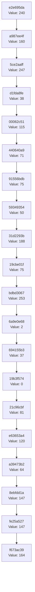

# Hash Chain Visualization

```mermaid
graph TD
    C0["f673ac39<br/>Value: 164"]
    C1["fe25a527<br/>Value: 147"]
    C1 --> C0
    C2["8ebfdd1a<br/>Value: 147"]
    C2 --> C1
    C3["a39473b2<br/>Value: 64"]
    C3 --> C2
    C4["e63653a4<br/>Value: 120"]
    C4 --> C3
    C5["21c96cbf<br/>Value: 81"]
    C5 --> C4
    C6["19b3f574<br/>Value: 0"]
    C6 --> C5
    C7["694155b3<br/>Value: 37"]
    C7 --> C6
    C8["6a9e0e68<br/>Value: 2"]
    C8 --> C7
    C9["bdbd3067<br/>Value: 253"]
    C9 --> C8
    C10["19cbe01f<br/>Value: 75"]
    C10 --> C9
    C11["31d2293b<br/>Value: 188"]
    C11 --> C10
    C12["59349354<br/>Value: 50"]
    C12 --> C11
    C13["91556bdb<br/>Value: 75"]
    C13 --> C12
    C14["440640a9<br/>Value: 71"]
    C14 --> C13
    C15["00062c51<br/>Value: 115"]
    C15 --> C14
    C16["d1fda8fe<br/>Value: 38"]
    C16 --> C15
    C17["5ce2aaff<br/>Value: 247"]
    C17 --> C16
    C18["a987ee4f<br/>Value: 160"]
    C18 --> C17
    C19["e2e695da<br/>Value: 240"]
    C19 --> C18
```