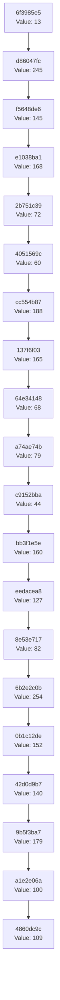

# Hash Chain Visualization

```mermaid
graph TD
    C0["4860dc9c<br/>Value: 109"]
    C1["a1e2e06a<br/>Value: 100"]
    C1 --> C0
    C2["9b5f3ba7<br/>Value: 179"]
    C2 --> C1
    C3["42d0d9b7<br/>Value: 140"]
    C3 --> C2
    C4["0b1c12de<br/>Value: 152"]
    C4 --> C3
    C5["6b2e2c0b<br/>Value: 254"]
    C5 --> C4
    C6["8e53e717<br/>Value: 82"]
    C6 --> C5
    C7["eedacea8<br/>Value: 127"]
    C7 --> C6
    C8["bb3f1e5e<br/>Value: 160"]
    C8 --> C7
    C9["c9152bba<br/>Value: 44"]
    C9 --> C8
    C10["a74ae74b<br/>Value: 79"]
    C10 --> C9
    C11["64e34148<br/>Value: 68"]
    C11 --> C10
    C12["137f6f03<br/>Value: 165"]
    C12 --> C11
    C13["cc554b87<br/>Value: 188"]
    C13 --> C12
    C14["4051569c<br/>Value: 60"]
    C14 --> C13
    C15["2b751c39<br/>Value: 72"]
    C15 --> C14
    C16["e1038ba1<br/>Value: 168"]
    C16 --> C15
    C17["f5648de6<br/>Value: 145"]
    C17 --> C16
    C18["d86047fc<br/>Value: 245"]
    C18 --> C17
    C19["6f3985e5<br/>Value: 13"]
    C19 --> C18
```