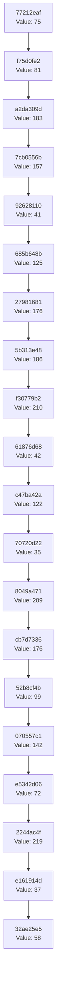

# Hash Chain Visualization

```mermaid
graph TD
    C0["32ae25e5<br/>Value: 58"]
    C1["e161914d<br/>Value: 37"]
    C1 --> C0
    C2["2244ac4f<br/>Value: 219"]
    C2 --> C1
    C3["e5342d06<br/>Value: 72"]
    C3 --> C2
    C4["070557c1<br/>Value: 142"]
    C4 --> C3
    C5["52b8cf4b<br/>Value: 99"]
    C5 --> C4
    C6["cb7d7336<br/>Value: 176"]
    C6 --> C5
    C7["8049a471<br/>Value: 209"]
    C7 --> C6
    C8["70720d22<br/>Value: 35"]
    C8 --> C7
    C9["c47ba42a<br/>Value: 122"]
    C9 --> C8
    C10["61876d68<br/>Value: 42"]
    C10 --> C9
    C11["f30779b2<br/>Value: 210"]
    C11 --> C10
    C12["5b313e48<br/>Value: 186"]
    C12 --> C11
    C13["27981681<br/>Value: 176"]
    C13 --> C12
    C14["685b648b<br/>Value: 125"]
    C14 --> C13
    C15["92628110<br/>Value: 41"]
    C15 --> C14
    C16["7cb0556b<br/>Value: 157"]
    C16 --> C15
    C17["a2da309d<br/>Value: 183"]
    C17 --> C16
    C18["f75d0fe2<br/>Value: 81"]
    C18 --> C17
    C19["77212eaf<br/>Value: 75"]
    C19 --> C18
```