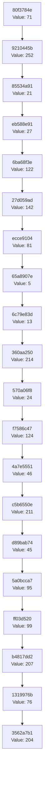

# Hash Chain Visualization

```mermaid
graph TD
    C0["3562a7b1<br/>Value: 204"]
    C1["1319976b<br/>Value: 76"]
    C1 --> C0
    C2["b4817dd2<br/>Value: 207"]
    C2 --> C1
    C3["ff03d520<br/>Value: 99"]
    C3 --> C2
    C4["5a0bcca7<br/>Value: 95"]
    C4 --> C3
    C5["d89bab74<br/>Value: 45"]
    C5 --> C4
    C6["c5b6550e<br/>Value: 211"]
    C6 --> C5
    C7["4a7e5551<br/>Value: 46"]
    C7 --> C6
    C8["f7586c47<br/>Value: 124"]
    C8 --> C7
    C9["570a06f8<br/>Value: 24"]
    C9 --> C8
    C10["360aa250<br/>Value: 214"]
    C10 --> C9
    C11["6c79e83d<br/>Value: 13"]
    C11 --> C10
    C12["65a8907e<br/>Value: 5"]
    C12 --> C11
    C13["ecce9104<br/>Value: 81"]
    C13 --> C12
    C14["27d059ad<br/>Value: 142"]
    C14 --> C13
    C15["6ba68f3e<br/>Value: 122"]
    C15 --> C14
    C16["eb588e91<br/>Value: 27"]
    C16 --> C15
    C17["85534a91<br/>Value: 21"]
    C17 --> C16
    C18["9210445b<br/>Value: 252"]
    C18 --> C17
    C19["80f3784e<br/>Value: 71"]
    C19 --> C18
```