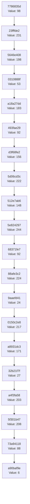

# Hash Chain Visualization

```mermaid
graph TD
    C0["a90baf9e<br/>Value: 6"]
    C1["73a94118<br/>Value: 88"]
    C1 --> C0
    C2["5f301b47<br/>Value: 208"]
    C2 --> C1
    C3["a4f3fa58<br/>Value: 203"]
    C3 --> C2
    C4["32b21f7f<br/>Value: 27"]
    C4 --> C3
    C5["a8931dc3<br/>Value: 171"]
    C5 --> C4
    C6["0150c2e8<br/>Value: 217"]
    C6 --> C5
    C7["9aaefd41<br/>Value: 24"]
    C7 --> C6
    C8["88afe3c2<br/>Value: 224"]
    C8 --> C7
    C9["68371fe7<br/>Value: 92"]
    C9 --> C8
    C10["5e824297<br/>Value: 244"]
    C10 --> C9
    C11["512e7ab6<br/>Value: 148"]
    C11 --> C10
    C12["5d06cd3c<br/>Value: 222"]
    C12 --> C11
    C13["d3f68fe2<br/>Value: 156"]
    C13 --> C12
    C14["493fae29<br/>Value: 92"]
    C14 --> C13
    C15["a18a27dd<br/>Value: 183"]
    C15 --> C14
    C16["0310888f<br/>Value: 53"]
    C16 --> C15
    C17["5646e408<br/>Value: 198"]
    C17 --> C16
    C18["23fffde2<br/>Value: 231"]
    C18 --> C17
    C19["7786835d<br/>Value: 98"]
    C19 --> C18
```