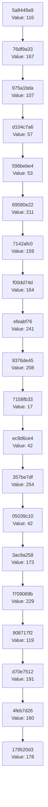

# Hash Chain Visualization

```mermaid
graph TD
    C0["179520d3<br/>Value: 178"]
    C1["4feb7d26<br/>Value: 160"]
    C1 --> C0
    C2["d70e7512<br/>Value: 191"]
    C2 --> C1
    C3["908717f2<br/>Value: 119"]
    C3 --> C2
    C4["f709069b<br/>Value: 229"]
    C4 --> C3
    C5["3ac9a258<br/>Value: 173"]
    C5 --> C4
    C6["05039c10<br/>Value: 42"]
    C6 --> C5
    C7["357be7df<br/>Value: 254"]
    C7 --> C6
    C8["ec9d6ce4<br/>Value: 42"]
    C8 --> C7
    C9["7158fb33<br/>Value: 17"]
    C9 --> C8
    C10["9376de45<br/>Value: 208"]
    C10 --> C9
    C11["efeabf76<br/>Value: 241"]
    C11 --> C10
    C12["f00dd74d<br/>Value: 164"]
    C12 --> C11
    C13["7142afc0<br/>Value: 159"]
    C13 --> C12
    C14["69580e22<br/>Value: 211"]
    C14 --> C13
    C15["596bebe4<br/>Value: 53"]
    C15 --> C14
    C16["d104c7a6<br/>Value: 57"]
    C16 --> C15
    C17["975a1bda<br/>Value: 107"]
    C17 --> C16
    C18["76df9a33<br/>Value: 167"]
    C18 --> C17
    C19["5a8448a9<br/>Value: 116"]
    C19 --> C18
```