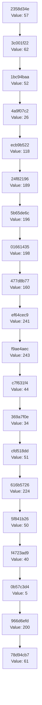

# Hash Chain Visualization

```mermaid
graph TD
    C0["78d94cb7<br/>Value: 61"]
    C1["966d6efd<br/>Value: 200"]
    C1 --> C0
    C2["0b57c3d4<br/>Value: 5"]
    C2 --> C1
    C3["f4723ad9<br/>Value: 40"]
    C3 --> C2
    C4["5f841b26<br/>Value: 50"]
    C4 --> C3
    C5["616b5726<br/>Value: 224"]
    C5 --> C4
    C6["cfd518dd<br/>Value: 51"]
    C6 --> C5
    C7["369a7f0e<br/>Value: 34"]
    C7 --> C6
    C8["c7f631f4<br/>Value: 44"]
    C8 --> C7
    C9["f9ae4aec<br/>Value: 243"]
    C9 --> C8
    C10["ef64cec9<br/>Value: 241"]
    C10 --> C9
    C11["477d8b77<br/>Value: 160"]
    C11 --> C10
    C12["01661435<br/>Value: 198"]
    C12 --> C11
    C13["5b65de6c<br/>Value: 196"]
    C13 --> C12
    C14["24f82196<br/>Value: 189"]
    C14 --> C13
    C15["ecb9b522<br/>Value: 118"]
    C15 --> C14
    C16["4a9f07c2<br/>Value: 26"]
    C16 --> C15
    C17["1bc94baa<br/>Value: 52"]
    C17 --> C16
    C18["3c001f22<br/>Value: 62"]
    C18 --> C17
    C19["2358d34e<br/>Value: 57"]
    C19 --> C18
```