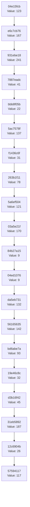

# Hash Chain Visualization

```mermaid
graph TD
    C0["57594117<br/>Value: 117"]
    C1["12c6904b<br/>Value: 26"]
    C1 --> C0
    C2["31eb5892<br/>Value: 187"]
    C2 --> C1
    C3["d3b16f42<br/>Value: 45"]
    C3 --> C2
    C4["19e46c8c<br/>Value: 32"]
    C4 --> C3
    C5["bd6abe7a<br/>Value: 93"]
    C5 --> C4
    C6["56165635<br/>Value: 142"]
    C6 --> C5
    C7["da5eb731<br/>Value: 132"]
    C7 --> C6
    C8["04ed1076<br/>Value: 9"]
    C8 --> C7
    C9["84b27a15<br/>Value: 9"]
    C9 --> C8
    C10["03a5e21f<br/>Value: 170"]
    C10 --> C9
    C11["5a6ef504<br/>Value: 121"]
    C11 --> C10
    C12["263b1f11<br/>Value: 78"]
    C12 --> C11
    C13["f1436c6f<br/>Value: 31"]
    C13 --> C12
    C14["5ac7578f<br/>Value: 137"]
    C14 --> C13
    C15["bbb8f05b<br/>Value: 22"]
    C15 --> C14
    C16["7887eadc<br/>Value: 41"]
    C16 --> C15
    C17["931ebe18<br/>Value: 241"]
    C17 --> C16
    C18["e6c7cb76<br/>Value: 167"]
    C18 --> C17
    C19["04e15fcb<br/>Value: 123"]
    C19 --> C18
```