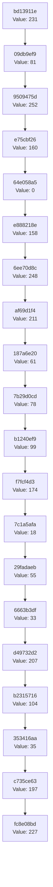

# Hash Chain Visualization

```mermaid
graph TD
    C0["fc8e08bd<br/>Value: 227"]
    C1["c735ce63<br/>Value: 197"]
    C1 --> C0
    C2["353416aa<br/>Value: 35"]
    C2 --> C1
    C3["b2315716<br/>Value: 104"]
    C3 --> C2
    C4["d49732d2<br/>Value: 207"]
    C4 --> C3
    C5["6663b3df<br/>Value: 33"]
    C5 --> C4
    C6["29fadaeb<br/>Value: 55"]
    C6 --> C5
    C7["7c1a5afa<br/>Value: 18"]
    C7 --> C6
    C8["f7fcf4d3<br/>Value: 174"]
    C8 --> C7
    C9["b1240ef9<br/>Value: 99"]
    C9 --> C8
    C10["7b29d0cd<br/>Value: 78"]
    C10 --> C9
    C11["187a6e20<br/>Value: 61"]
    C11 --> C10
    C12["af69d1f4<br/>Value: 211"]
    C12 --> C11
    C13["6ee70d8c<br/>Value: 248"]
    C13 --> C12
    C14["e888218e<br/>Value: 158"]
    C14 --> C13
    C15["64e058a5<br/>Value: 0"]
    C15 --> C14
    C16["e75cbf26<br/>Value: 160"]
    C16 --> C15
    C17["9509475d<br/>Value: 252"]
    C17 --> C16
    C18["09db9ef9<br/>Value: 81"]
    C18 --> C17
    C19["bd13911e<br/>Value: 231"]
    C19 --> C18
```