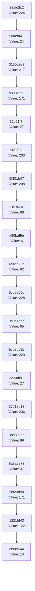

# Hash Chain Visualization

```mermaid
graph TD
    C0["eb0f9544<br/>Value: 16"]
    C1["1221bf43<br/>Value: 122"]
    C1 --> C0
    C2["cef23bab<br/>Value: 171"]
    C2 --> C1
    C3["8a3a2873<br/>Value: 37"]
    C3 --> C2
    C4["3bd892dc<br/>Value: 99"]
    C4 --> C3
    C5["37d18d13<br/>Value: 236"]
    C5 --> C4
    C6["dc24df81<br/>Value: 27"]
    C6 --> C5
    C7["bcb3bc31<br/>Value: 220"]
    C7 --> C6
    C8["0d0e1eba<br/>Value: 65"]
    C8 --> C7
    C9["5cd8e55d<br/>Value: 228"]
    C9 --> C8
    C10["4d4ed26d<br/>Value: 82"]
    C10 --> C9
    C11["a90baf9e<br/>Value: 6"]
    C11 --> C10
    C12["73a94118<br/>Value: 88"]
    C12 --> C11
    C13["5f301b47<br/>Value: 208"]
    C13 --> C12
    C14["a4f3fa58<br/>Value: 203"]
    C14 --> C13
    C15["32b21f7f<br/>Value: 27"]
    C15 --> C14
    C16["a8931dc3<br/>Value: 171"]
    C16 --> C15
    C17["0150c2e8<br/>Value: 217"]
    C17 --> C16
    C18["9aaefd41<br/>Value: 24"]
    C18 --> C17
    C19["88afe3c2<br/>Value: 224"]
    C19 --> C18
```