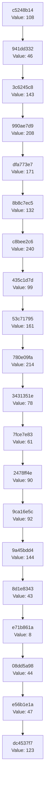

# Hash Chain Visualization

```mermaid
graph TD
    C0["dc4537f7<br/>Value: 123"]
    C1["e56b1e1a<br/>Value: 47"]
    C1 --> C0
    C2["08dd5a98<br/>Value: 44"]
    C2 --> C1
    C3["e71b861a<br/>Value: 8"]
    C3 --> C2
    C4["8d1e8343<br/>Value: 43"]
    C4 --> C3
    C5["9a45bdd4<br/>Value: 144"]
    C5 --> C4
    C6["9ca16e5c<br/>Value: 92"]
    C6 --> C5
    C7["2478ff4e<br/>Value: 90"]
    C7 --> C6
    C8["7fce7e83<br/>Value: 61"]
    C8 --> C7
    C9["3431351e<br/>Value: 78"]
    C9 --> C8
    C10["780e09fa<br/>Value: 214"]
    C10 --> C9
    C11["53c71795<br/>Value: 161"]
    C11 --> C10
    C12["435c1d7d<br/>Value: 99"]
    C12 --> C11
    C13["c8bee2c6<br/>Value: 240"]
    C13 --> C12
    C14["8b8c7ec5<br/>Value: 132"]
    C14 --> C13
    C15["dfa773e7<br/>Value: 171"]
    C15 --> C14
    C16["990ae7d9<br/>Value: 208"]
    C16 --> C15
    C17["3c6245c8<br/>Value: 143"]
    C17 --> C16
    C18["941dd332<br/>Value: 46"]
    C18 --> C17
    C19["c5248b14<br/>Value: 108"]
    C19 --> C18
```