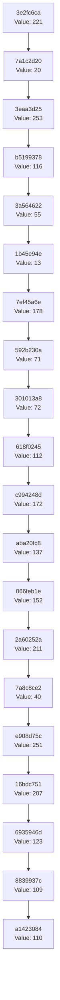

# Hash Chain Visualization

```mermaid
graph TD
    C0["a1423084<br/>Value: 110"]
    C1["8839937c<br/>Value: 109"]
    C1 --> C0
    C2["6935946d<br/>Value: 123"]
    C2 --> C1
    C3["16bdc751<br/>Value: 207"]
    C3 --> C2
    C4["e908d75c<br/>Value: 251"]
    C4 --> C3
    C5["7a8c8ce2<br/>Value: 40"]
    C5 --> C4
    C6["2a60252a<br/>Value: 211"]
    C6 --> C5
    C7["066feb1e<br/>Value: 152"]
    C7 --> C6
    C8["aba20fc8<br/>Value: 137"]
    C8 --> C7
    C9["c994248d<br/>Value: 172"]
    C9 --> C8
    C10["618f0245<br/>Value: 112"]
    C10 --> C9
    C11["301013a8<br/>Value: 72"]
    C11 --> C10
    C12["592b230a<br/>Value: 71"]
    C12 --> C11
    C13["7ef45a6e<br/>Value: 178"]
    C13 --> C12
    C14["1b45e94e<br/>Value: 13"]
    C14 --> C13
    C15["3a564622<br/>Value: 55"]
    C15 --> C14
    C16["b5199378<br/>Value: 116"]
    C16 --> C15
    C17["3eaa3d25<br/>Value: 253"]
    C17 --> C16
    C18["7a1c2d20<br/>Value: 20"]
    C18 --> C17
    C19["3e2fc6ca<br/>Value: 221"]
    C19 --> C18
```