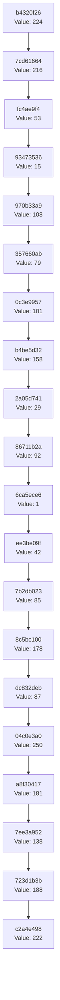

# Hash Chain Visualization

```mermaid
graph TD
    C0["c2a4e498<br/>Value: 222"]
    C1["723d1b3b<br/>Value: 188"]
    C1 --> C0
    C2["7ee3a952<br/>Value: 138"]
    C2 --> C1
    C3["a8f30417<br/>Value: 181"]
    C3 --> C2
    C4["04c0e3a0<br/>Value: 250"]
    C4 --> C3
    C5["dc832deb<br/>Value: 87"]
    C5 --> C4
    C6["8c5bc100<br/>Value: 178"]
    C6 --> C5
    C7["7b2db023<br/>Value: 85"]
    C7 --> C6
    C8["ee3be09f<br/>Value: 42"]
    C8 --> C7
    C9["6ca5ece6<br/>Value: 1"]
    C9 --> C8
    C10["86711b2a<br/>Value: 92"]
    C10 --> C9
    C11["2a05d741<br/>Value: 29"]
    C11 --> C10
    C12["b4be5d32<br/>Value: 158"]
    C12 --> C11
    C13["0c3e9957<br/>Value: 101"]
    C13 --> C12
    C14["357660ab<br/>Value: 79"]
    C14 --> C13
    C15["970b33a9<br/>Value: 108"]
    C15 --> C14
    C16["93473536<br/>Value: 15"]
    C16 --> C15
    C17["fc4ae9f4<br/>Value: 53"]
    C17 --> C16
    C18["7cd61664<br/>Value: 216"]
    C18 --> C17
    C19["b4320f26<br/>Value: 224"]
    C19 --> C18
```