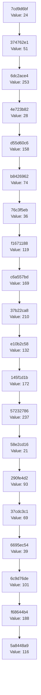

# Hash Chain Visualization

```mermaid
graph TD
    C0["5a8448a9<br/>Value: 116"]
    C1["f68644b4<br/>Value: 188"]
    C1 --> C0
    C2["6c9d76de<br/>Value: 101"]
    C2 --> C1
    C3["6695ec54<br/>Value: 39"]
    C3 --> C2
    C4["37cdc3c1<br/>Value: 69"]
    C4 --> C3
    C5["290fe4d2<br/>Value: 93"]
    C5 --> C4
    C6["58e2cd16<br/>Value: 21"]
    C6 --> C5
    C7["57232786<br/>Value: 237"]
    C7 --> C6
    C8["145f1d1b<br/>Value: 172"]
    C8 --> C7
    C9["e10b2c58<br/>Value: 132"]
    C9 --> C8
    C10["37b22ca8<br/>Value: 210"]
    C10 --> C9
    C11["c6a557bd<br/>Value: 169"]
    C11 --> C10
    C12["f1671188<br/>Value: 119"]
    C12 --> C11
    C13["76c3f5eb<br/>Value: 36"]
    C13 --> C12
    C14["b8426962<br/>Value: 74"]
    C14 --> C13
    C15["d55d60c6<br/>Value: 158"]
    C15 --> C14
    C16["4e723b82<br/>Value: 28"]
    C16 --> C15
    C17["6dc2ace4<br/>Value: 253"]
    C17 --> C16
    C18["374762e1<br/>Value: 51"]
    C18 --> C17
    C19["7cd9d6bf<br/>Value: 24"]
    C19 --> C18
```