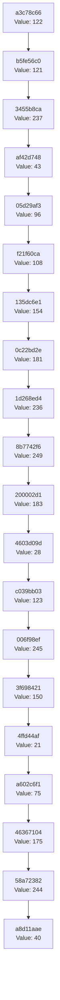

# Hash Chain Visualization

```mermaid
graph TD
    C0["a8d11aae<br/>Value: 40"]
    C1["58a72382<br/>Value: 244"]
    C1 --> C0
    C2["46367104<br/>Value: 175"]
    C2 --> C1
    C3["a602c6f1<br/>Value: 75"]
    C3 --> C2
    C4["4ffd44af<br/>Value: 21"]
    C4 --> C3
    C5["3f698421<br/>Value: 150"]
    C5 --> C4
    C6["006f98ef<br/>Value: 245"]
    C6 --> C5
    C7["c039bb03<br/>Value: 123"]
    C7 --> C6
    C8["4603d09d<br/>Value: 28"]
    C8 --> C7
    C9["200002d1<br/>Value: 183"]
    C9 --> C8
    C10["8b7742f6<br/>Value: 249"]
    C10 --> C9
    C11["1d268ed4<br/>Value: 236"]
    C11 --> C10
    C12["0c22bd2e<br/>Value: 181"]
    C12 --> C11
    C13["135dc6e1<br/>Value: 154"]
    C13 --> C12
    C14["f21f60ca<br/>Value: 108"]
    C14 --> C13
    C15["05d29af3<br/>Value: 96"]
    C15 --> C14
    C16["af42d748<br/>Value: 43"]
    C16 --> C15
    C17["3455b8ca<br/>Value: 237"]
    C17 --> C16
    C18["b5fe56c0<br/>Value: 121"]
    C18 --> C17
    C19["a3c78c66<br/>Value: 122"]
    C19 --> C18
```