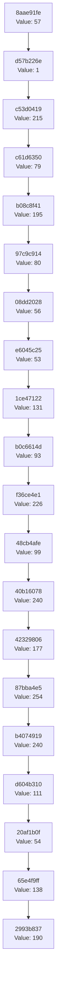

# Hash Chain Visualization

```mermaid
graph TD
    C0["2993b837<br/>Value: 190"]
    C1["65e4f9ff<br/>Value: 138"]
    C1 --> C0
    C2["20af1b0f<br/>Value: 54"]
    C2 --> C1
    C3["d604b310<br/>Value: 111"]
    C3 --> C2
    C4["b4074919<br/>Value: 240"]
    C4 --> C3
    C5["87bba4e5<br/>Value: 254"]
    C5 --> C4
    C6["42329806<br/>Value: 177"]
    C6 --> C5
    C7["40b16078<br/>Value: 240"]
    C7 --> C6
    C8["48cb4afe<br/>Value: 99"]
    C8 --> C7
    C9["f36ce4e1<br/>Value: 226"]
    C9 --> C8
    C10["b0c6614d<br/>Value: 93"]
    C10 --> C9
    C11["1ce47122<br/>Value: 131"]
    C11 --> C10
    C12["e6045c25<br/>Value: 53"]
    C12 --> C11
    C13["08dd2028<br/>Value: 56"]
    C13 --> C12
    C14["97c9c914<br/>Value: 80"]
    C14 --> C13
    C15["b08c8f41<br/>Value: 195"]
    C15 --> C14
    C16["c61d6350<br/>Value: 79"]
    C16 --> C15
    C17["c53d0419<br/>Value: 215"]
    C17 --> C16
    C18["d57b226e<br/>Value: 1"]
    C18 --> C17
    C19["8aae91fe<br/>Value: 57"]
    C19 --> C18
```