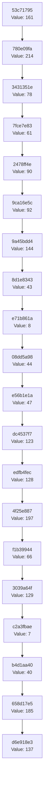

# Hash Chain Visualization

```mermaid
graph TD
    C0["d6e918e3<br/>Value: 137"]
    C1["658d17e5<br/>Value: 185"]
    C1 --> C0
    C2["b4d1aa40<br/>Value: 40"]
    C2 --> C1
    C3["c2a3fbae<br/>Value: 7"]
    C3 --> C2
    C4["3039a64f<br/>Value: 129"]
    C4 --> C3
    C5["f1b39944<br/>Value: 66"]
    C5 --> C4
    C6["4f25e887<br/>Value: 197"]
    C6 --> C5
    C7["edfb4fec<br/>Value: 128"]
    C7 --> C6
    C8["dc4537f7<br/>Value: 123"]
    C8 --> C7
    C9["e56b1e1a<br/>Value: 47"]
    C9 --> C8
    C10["08dd5a98<br/>Value: 44"]
    C10 --> C9
    C11["e71b861a<br/>Value: 8"]
    C11 --> C10
    C12["8d1e8343<br/>Value: 43"]
    C12 --> C11
    C13["9a45bdd4<br/>Value: 144"]
    C13 --> C12
    C14["9ca16e5c<br/>Value: 92"]
    C14 --> C13
    C15["2478ff4e<br/>Value: 90"]
    C15 --> C14
    C16["7fce7e83<br/>Value: 61"]
    C16 --> C15
    C17["3431351e<br/>Value: 78"]
    C17 --> C16
    C18["780e09fa<br/>Value: 214"]
    C18 --> C17
    C19["53c71795<br/>Value: 161"]
    C19 --> C18
```