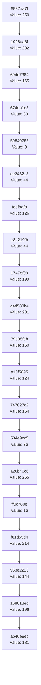

# Hash Chain Visualization

```mermaid
graph TD
    C0["ab46e8ec<br/>Value: 181"]
    C1["168618ed<br/>Value: 196"]
    C1 --> C0
    C2["963e2215<br/>Value: 144"]
    C2 --> C1
    C3["f81d55d4<br/>Value: 214"]
    C3 --> C2
    C4["ff0c780e<br/>Value: 16"]
    C4 --> C3
    C5["a26b46c6<br/>Value: 255"]
    C5 --> C4
    C6["534e9cc5<br/>Value: 76"]
    C6 --> C5
    C7["747027c2<br/>Value: 154"]
    C7 --> C6
    C8["a16f5895<br/>Value: 124"]
    C8 --> C7
    C9["39d98feb<br/>Value: 150"]
    C9 --> C8
    C10["a4d583b4<br/>Value: 201"]
    C10 --> C9
    C11["1747ef99<br/>Value: 199"]
    C11 --> C10
    C12["e8d219fb<br/>Value: 44"]
    C12 --> C11
    C13["fedf8afb<br/>Value: 126"]
    C13 --> C12
    C14["ee243218<br/>Value: 44"]
    C14 --> C13
    C15["59849785<br/>Value: 9"]
    C15 --> C14
    C16["674db1e3<br/>Value: 83"]
    C16 --> C15
    C17["69de7384<br/>Value: 165"]
    C17 --> C16
    C18["1928da8f<br/>Value: 202"]
    C18 --> C17
    C19["6587aa7f<br/>Value: 250"]
    C19 --> C18
```