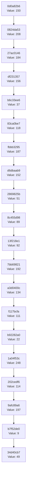

# Hash Chain Visualization

```mermaid
graph TD
    C0["34d40cb7<br/>Value: 49"]
    C1["b7f52de0<br/>Value: 9"]
    C1 --> C0
    C2["9afc89a6<br/>Value: 197"]
    C2 --> C1
    C3["202cedf6<br/>Value: 114"]
    C3 --> C2
    C4["1a04f53c<br/>Value: 248"]
    C4 --> C3
    C5["b92282a0<br/>Value: 22"]
    C5 --> C4
    C6["f117bcfa<br/>Value: 111"]
    C6 --> C5
    C7["a3d0400c<br/>Value: 134"]
    C7 --> C6
    C8["7bb69821<br/>Value: 192"]
    C8 --> C7
    C9["13f218e1<br/>Value: 92"]
    C9 --> C8
    C10["8c455d98<br/>Value: 89"]
    C10 --> C9
    C11["2869825b<br/>Value: 51"]
    C11 --> C10
    C12["d6dbaab9<br/>Value: 152"]
    C12 --> C11
    C13["fbbb3295<br/>Value: 187"]
    C13 --> C12
    C14["83ca0be7<br/>Value: 118"]
    C14 --> C13
    C15["b6c33ee6<br/>Value: 37"]
    C15 --> C14
    C16["df231357<br/>Value: 156"]
    C16 --> C15
    C17["27ac0146<br/>Value: 184"]
    C17 --> C16
    C18["0824da53<br/>Value: 208"]
    C18 --> C17
    C19["0d0a82b6<br/>Value: 150"]
    C19 --> C18
```