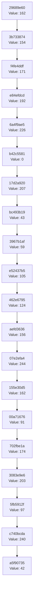

# Hash Chain Visualization

```mermaid
graph TD
    C0["a5f90735<br/>Value: 42"]
    C1["c740bcda<br/>Value: 240"]
    C1 --> C0
    C2["5fb5912f<br/>Value: 97"]
    C2 --> C1
    C3["3083e9e6<br/>Value: 203"]
    C3 --> C2
    C4["702fbe1a<br/>Value: 174"]
    C4 --> C3
    C5["00a71676<br/>Value: 91"]
    C5 --> C4
    C6["155e30d5<br/>Value: 162"]
    C6 --> C5
    C7["07e2efa4<br/>Value: 244"]
    C7 --> C6
    C8["aefd3636<br/>Value: 156"]
    C8 --> C7
    C9["462e6795<br/>Value: 124"]
    C9 --> C8
    C10["e52437b5<br/>Value: 105"]
    C10 --> C9
    C11["3967b1af<br/>Value: 59"]
    C11 --> C10
    C12["bc493b19<br/>Value: 43"]
    C12 --> C11
    C13["17d2a920<br/>Value: 207"]
    C13 --> C12
    C14["b42c5581<br/>Value: 0"]
    C14 --> C13
    C15["6a4f9ae5<br/>Value: 226"]
    C15 --> C14
    C16["e84efdcd<br/>Value: 192"]
    C16 --> C15
    C17["f4fe4ddf<br/>Value: 171"]
    C17 --> C16
    C18["3b733874<br/>Value: 154"]
    C18 --> C17
    C19["29689e60<br/>Value: 162"]
    C19 --> C18
```