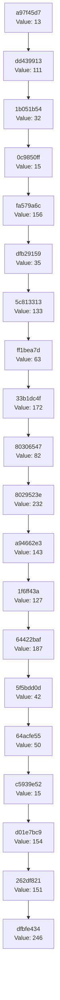

# Hash Chain Visualization

```mermaid
graph TD
    C0["dfbfe434<br/>Value: 246"]
    C1["262df821<br/>Value: 151"]
    C1 --> C0
    C2["d01e7bc9<br/>Value: 154"]
    C2 --> C1
    C3["c5939e52<br/>Value: 15"]
    C3 --> C2
    C4["64acfe55<br/>Value: 50"]
    C4 --> C3
    C5["5f5bdd0d<br/>Value: 42"]
    C5 --> C4
    C6["64422baf<br/>Value: 187"]
    C6 --> C5
    C7["1f6ff43a<br/>Value: 127"]
    C7 --> C6
    C8["a94662e3<br/>Value: 143"]
    C8 --> C7
    C9["8029523e<br/>Value: 232"]
    C9 --> C8
    C10["80306547<br/>Value: 82"]
    C10 --> C9
    C11["33b1dc4f<br/>Value: 172"]
    C11 --> C10
    C12["ff1bea7d<br/>Value: 63"]
    C12 --> C11
    C13["5c813313<br/>Value: 133"]
    C13 --> C12
    C14["dfb29159<br/>Value: 35"]
    C14 --> C13
    C15["fa579a6c<br/>Value: 156"]
    C15 --> C14
    C16["0c9850ff<br/>Value: 15"]
    C16 --> C15
    C17["1b051b54<br/>Value: 32"]
    C17 --> C16
    C18["dd439913<br/>Value: 111"]
    C18 --> C17
    C19["a97f45d7<br/>Value: 13"]
    C19 --> C18
```