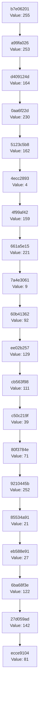

# Hash Chain Visualization

```mermaid
graph TD
    C0["ecce9104<br/>Value: 81"]
    C1["27d059ad<br/>Value: 142"]
    C1 --> C0
    C2["6ba68f3e<br/>Value: 122"]
    C2 --> C1
    C3["eb588e91<br/>Value: 27"]
    C3 --> C2
    C4["85534a91<br/>Value: 21"]
    C4 --> C3
    C5["9210445b<br/>Value: 252"]
    C5 --> C4
    C6["80f3784e<br/>Value: 71"]
    C6 --> C5
    C7["c50c219f<br/>Value: 39"]
    C7 --> C6
    C8["cb563f98<br/>Value: 111"]
    C8 --> C7
    C9["ee02b257<br/>Value: 129"]
    C9 --> C8
    C10["60b41362<br/>Value: 92"]
    C10 --> C9
    C11["7a4e3061<br/>Value: 9"]
    C11 --> C10
    C12["661a5e15<br/>Value: 221"]
    C12 --> C11
    C13["4f99af42<br/>Value: 159"]
    C13 --> C12
    C14["4ecc2893<br/>Value: 4"]
    C14 --> C13
    C15["5123c5b8<br/>Value: 162"]
    C15 --> C14
    C16["0aa6f22d<br/>Value: 230"]
    C16 --> C15
    C17["d409124d<br/>Value: 164"]
    C17 --> C16
    C18["a99fa026<br/>Value: 253"]
    C18 --> C17
    C19["b7e06201<br/>Value: 255"]
    C19 --> C18
```