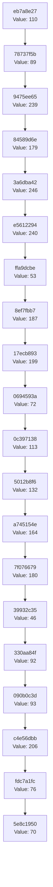

# Hash Chain Visualization

```mermaid
graph TD
    C0["5e8c1950<br/>Value: 70"]
    C1["fdc7a1fc<br/>Value: 76"]
    C1 --> C0
    C2["c4e56dbb<br/>Value: 206"]
    C2 --> C1
    C3["090b0c3d<br/>Value: 93"]
    C3 --> C2
    C4["330aa84f<br/>Value: 92"]
    C4 --> C3
    C5["39932c35<br/>Value: 46"]
    C5 --> C4
    C6["7f076679<br/>Value: 180"]
    C6 --> C5
    C7["a745154e<br/>Value: 164"]
    C7 --> C6
    C8["5012b8f6<br/>Value: 132"]
    C8 --> C7
    C9["0c397138<br/>Value: 113"]
    C9 --> C8
    C10["0694593a<br/>Value: 72"]
    C10 --> C9
    C11["17ecb893<br/>Value: 199"]
    C11 --> C10
    C12["8ef7fbb7<br/>Value: 187"]
    C12 --> C11
    C13["ffa9dcbe<br/>Value: 53"]
    C13 --> C12
    C14["e5612294<br/>Value: 240"]
    C14 --> C13
    C15["3a6dba42<br/>Value: 246"]
    C15 --> C14
    C16["84589d6e<br/>Value: 179"]
    C16 --> C15
    C17["9475ee65<br/>Value: 239"]
    C17 --> C16
    C18["78737f5b<br/>Value: 89"]
    C18 --> C17
    C19["eb7a8e27<br/>Value: 110"]
    C19 --> C18
```