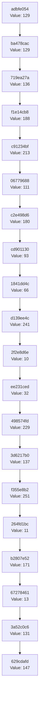

# Hash Chain Visualization

```mermaid
graph TD
    C0["629cdafd<br/>Value: 147"]
    C1["3a52c0c6<br/>Value: 131"]
    C1 --> C0
    C2["67278461<br/>Value: 13"]
    C2 --> C1
    C3["b2807e52<br/>Value: 171"]
    C3 --> C2
    C4["264fd1bc<br/>Value: 11"]
    C4 --> C3
    C5["f355e8b2<br/>Value: 251"]
    C5 --> C4
    C6["3d6217b0<br/>Value: 137"]
    C6 --> C5
    C7["498574fd<br/>Value: 229"]
    C7 --> C6
    C8["ee231ced<br/>Value: 32"]
    C8 --> C7
    C9["2f2e8d6e<br/>Value: 10"]
    C9 --> C8
    C10["d139ee4c<br/>Value: 241"]
    C10 --> C9
    C11["1841dd4c<br/>Value: 66"]
    C11 --> C10
    C12["cd901130<br/>Value: 93"]
    C12 --> C11
    C13["c2e498d6<br/>Value: 180"]
    C13 --> C12
    C14["06779688<br/>Value: 111"]
    C14 --> C13
    C15["c91234bf<br/>Value: 213"]
    C15 --> C14
    C16["f1e14cb8<br/>Value: 188"]
    C16 --> C15
    C17["719ea27a<br/>Value: 136"]
    C17 --> C16
    C18["ba478cac<br/>Value: 129"]
    C18 --> C17
    C19["adbfe054<br/>Value: 129"]
    C19 --> C18
```