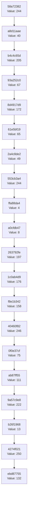

# Hash Chain Visualization

```mermaid
graph TD
    C0["ebd87755<br/>Value: 132"]
    C1["4274f021<br/>Value: 250"]
    C1 --> C0
    C2["b26f1968<br/>Value: 13"]
    C2 --> C1
    C3["9a57c9e8<br/>Value: 222"]
    C3 --> C2
    C4["ab87ff55<br/>Value: 111"]
    C4 --> C3
    C5["0f0e37cf<br/>Value: 75"]
    C5 --> C4
    C6["40460f82<br/>Value: 246"]
    C6 --> C5
    C7["f8e1b342<br/>Value: 158"]
    C7 --> C6
    C8["1c0ab4d9<br/>Value: 176"]
    C8 --> C7
    C9["263792fe<br/>Value: 197"]
    C9 --> C8
    C10["a0cfdb47<br/>Value: 8"]
    C10 --> C9
    C11["ffa88da4<br/>Value: 4"]
    C11 --> C10
    C12["553cb3a4<br/>Value: 244"]
    C12 --> C11
    C13["2a4c8de2<br/>Value: 49"]
    C13 --> C12
    C14["61e5bf19<br/>Value: 65"]
    C14 --> C13
    C15["8d4917d9<br/>Value: 172"]
    C15 --> C14
    C16["93a252c0<br/>Value: 67"]
    C16 --> C15
    C17["b4c4c65d<br/>Value: 205"]
    C17 --> C16
    C18["a8d11aae<br/>Value: 40"]
    C18 --> C17
    C19["58a72382<br/>Value: 244"]
    C19 --> C18
```