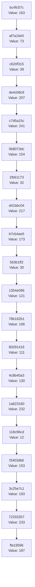

# Hash Chain Visualization

```mermaid
graph TD
    C0["ffa19596<br/>Value: 187"]
    C1["72333357<br/>Value: 233"]
    C1 --> C0
    C2["3c25e7c1<br/>Value: 193"]
    C2 --> C1
    C3["f3403db6<br/>Value: 153"]
    C3 --> C2
    C4["118c96cd<br/>Value: 12"]
    C4 --> C3
    C5["1a623160<br/>Value: 232"]
    C5 --> C4
    C6["4c8b40a3<br/>Value: 130"]
    C6 --> C5
    C7["80291416<br/>Value: 111"]
    C7 --> C6
    C8["78b162b1<br/>Value: 106"]
    C8 --> C7
    C9["1354e096<br/>Value: 121"]
    C9 --> C8
    C10["563b1ff2<br/>Value: 30"]
    C10 --> C9
    C11["b7cb4ae5<br/>Value: 173"]
    C11 --> C10
    C12["d41bbc04<br/>Value: 217"]
    C12 --> C11
    C13["1fb61173<br/>Value: 32"]
    C13 --> C12
    C14["0b8073dc<br/>Value: 154"]
    C14 --> C13
    C15["c7d5a15c<br/>Value: 241"]
    C15 --> C14
    C16["de4cb8c9<br/>Value: 207"]
    C16 --> C15
    C17["c620f315<br/>Value: 39"]
    C17 --> C16
    C18["af7a16e5<br/>Value: 73"]
    C18 --> C17
    C19["bc4fc57c<br/>Value: 163"]
    C19 --> C18
```