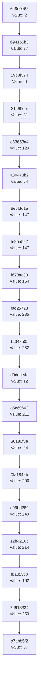

# Hash Chain Visualization

```mermaid
graph TD
    C0["a7abb5f2<br/>Value: 87"]
    C1["7d918334<br/>Value: 250"]
    C1 --> C0
    C2["fba613c6<br/>Value: 162"]
    C2 --> C1
    C3["12b4216b<br/>Value: 214"]
    C3 --> C2
    C4["d99bd280<br/>Value: 249"]
    C4 --> C3
    C5["0fa184ab<br/>Value: 206"]
    C5 --> C4
    C6["36a80f8e<br/>Value: 24"]
    C6 --> C5
    C7["a5c69602<br/>Value: 211"]
    C7 --> C6
    C8["d0ddce4e<br/>Value: 12"]
    C8 --> C7
    C9["1c347505<br/>Value: 232"]
    C9 --> C8
    C10["fad25723<br/>Value: 235"]
    C10 --> C9
    C11["f673ac39<br/>Value: 164"]
    C11 --> C10
    C12["fe25a527<br/>Value: 147"]
    C12 --> C11
    C13["8ebfdd1a<br/>Value: 147"]
    C13 --> C12
    C14["a39473b2<br/>Value: 64"]
    C14 --> C13
    C15["e63653a4<br/>Value: 120"]
    C15 --> C14
    C16["21c96cbf<br/>Value: 81"]
    C16 --> C15
    C17["19b3f574<br/>Value: 0"]
    C17 --> C16
    C18["694155b3<br/>Value: 37"]
    C18 --> C17
    C19["6a9e0e68<br/>Value: 2"]
    C19 --> C18
```