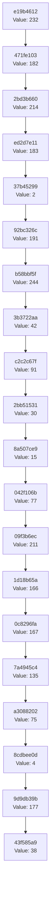

# Hash Chain Visualization

```mermaid
graph TD
    C0["43f585a9<br/>Value: 38"]
    C1["9d9db39b<br/>Value: 177"]
    C1 --> C0
    C2["8cdbee0d<br/>Value: 4"]
    C2 --> C1
    C3["a3088202<br/>Value: 75"]
    C3 --> C2
    C4["7a4945c4<br/>Value: 135"]
    C4 --> C3
    C5["0c8296fa<br/>Value: 167"]
    C5 --> C4
    C6["1d18b65a<br/>Value: 166"]
    C6 --> C5
    C7["09f3b6ec<br/>Value: 211"]
    C7 --> C6
    C8["042f106b<br/>Value: 77"]
    C8 --> C7
    C9["8a507ce9<br/>Value: 15"]
    C9 --> C8
    C10["2bb51531<br/>Value: 30"]
    C10 --> C9
    C11["c2c2c67f<br/>Value: 91"]
    C11 --> C10
    C12["3b3722aa<br/>Value: 42"]
    C12 --> C11
    C13["b58bbf5f<br/>Value: 244"]
    C13 --> C12
    C14["92bc326c<br/>Value: 191"]
    C14 --> C13
    C15["37b45299<br/>Value: 2"]
    C15 --> C14
    C16["ed2d7e11<br/>Value: 183"]
    C16 --> C15
    C17["2bd3b660<br/>Value: 214"]
    C17 --> C16
    C18["471fe103<br/>Value: 182"]
    C18 --> C17
    C19["e19b4612<br/>Value: 232"]
    C19 --> C18
```