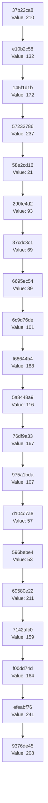

# Hash Chain Visualization

```mermaid
graph TD
    C0["9376de45<br/>Value: 208"]
    C1["efeabf76<br/>Value: 241"]
    C1 --> C0
    C2["f00dd74d<br/>Value: 164"]
    C2 --> C1
    C3["7142afc0<br/>Value: 159"]
    C3 --> C2
    C4["69580e22<br/>Value: 211"]
    C4 --> C3
    C5["596bebe4<br/>Value: 53"]
    C5 --> C4
    C6["d104c7a6<br/>Value: 57"]
    C6 --> C5
    C7["975a1bda<br/>Value: 107"]
    C7 --> C6
    C8["76df9a33<br/>Value: 167"]
    C8 --> C7
    C9["5a8448a9<br/>Value: 116"]
    C9 --> C8
    C10["f68644b4<br/>Value: 188"]
    C10 --> C9
    C11["6c9d76de<br/>Value: 101"]
    C11 --> C10
    C12["6695ec54<br/>Value: 39"]
    C12 --> C11
    C13["37cdc3c1<br/>Value: 69"]
    C13 --> C12
    C14["290fe4d2<br/>Value: 93"]
    C14 --> C13
    C15["58e2cd16<br/>Value: 21"]
    C15 --> C14
    C16["57232786<br/>Value: 237"]
    C16 --> C15
    C17["145f1d1b<br/>Value: 172"]
    C17 --> C16
    C18["e10b2c58<br/>Value: 132"]
    C18 --> C17
    C19["37b22ca8<br/>Value: 210"]
    C19 --> C18
```