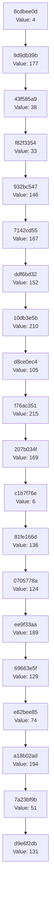

# Hash Chain Visualization

```mermaid
graph TD
    C0["d9e6f2db<br/>Value: 131"]
    C1["7a23bf9b<br/>Value: 51"]
    C1 --> C0
    C2["a18b02ad<br/>Value: 194"]
    C2 --> C1
    C3["e82bee85<br/>Value: 74"]
    C3 --> C2
    C4["69663e5f<br/>Value: 129"]
    C4 --> C3
    C5["ee9f33aa<br/>Value: 189"]
    C5 --> C4
    C6["0705778a<br/>Value: 124"]
    C6 --> C5
    C7["81fe166d<br/>Value: 136"]
    C7 --> C6
    C8["c1b7f76e<br/>Value: 6"]
    C8 --> C7
    C9["207b034f<br/>Value: 169"]
    C9 --> C8
    C10["f76ac351<br/>Value: 215"]
    C10 --> C9
    C11["d8ce0ec4<br/>Value: 105"]
    C11 --> C10
    C12["10db3e5b<br/>Value: 210"]
    C12 --> C11
    C13["ddf6bd32<br/>Value: 152"]
    C13 --> C12
    C14["7142cd55<br/>Value: 167"]
    C14 --> C13
    C15["932bc547<br/>Value: 146"]
    C15 --> C14
    C16["f82f3354<br/>Value: 33"]
    C16 --> C15
    C17["43f585a9<br/>Value: 38"]
    C17 --> C16
    C18["9d9db39b<br/>Value: 177"]
    C18 --> C17
    C19["8cdbee0d<br/>Value: 4"]
    C19 --> C18
```