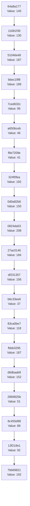

# Hash Chain Visualization

```mermaid
graph TD
    C0["7bb69821<br/>Value: 192"]
    C1["13f218e1<br/>Value: 92"]
    C1 --> C0
    C2["8c455d98<br/>Value: 89"]
    C2 --> C1
    C3["2869825b<br/>Value: 51"]
    C3 --> C2
    C4["d6dbaab9<br/>Value: 152"]
    C4 --> C3
    C5["fbbb3295<br/>Value: 187"]
    C5 --> C4
    C6["83ca0be7<br/>Value: 118"]
    C6 --> C5
    C7["b6c33ee6<br/>Value: 37"]
    C7 --> C6
    C8["df231357<br/>Value: 156"]
    C8 --> C7
    C9["27ac0146<br/>Value: 184"]
    C9 --> C8
    C10["0824da53<br/>Value: 208"]
    C10 --> C9
    C11["0d0a82b6<br/>Value: 150"]
    C11 --> C10
    C12["324f0fea<br/>Value: 192"]
    C12 --> C11
    C13["f8e7209e<br/>Value: 41"]
    C13 --> C12
    C14["a650bceb<br/>Value: 46"]
    C14 --> C13
    C15["7ced632c<br/>Value: 95"]
    C15 --> C14
    C16["bbec19f8<br/>Value: 189"]
    C16 --> C15
    C17["51046e48<br/>Value: 187"]
    C17 --> C16
    C18["11681f39<br/>Value: 130"]
    C18 --> C17
    C19["64a8a177<br/>Value: 145"]
    C19 --> C18
```