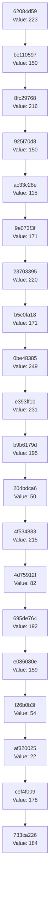

# Hash Chain Visualization

```mermaid
graph TD
    C0["733ca226<br/>Value: 184"]
    C1["cef4f009<br/>Value: 178"]
    C1 --> C0
    C2["af320025<br/>Value: 22"]
    C2 --> C1
    C3["f26b0b3f<br/>Value: 54"]
    C3 --> C2
    C4["e086080e<br/>Value: 159"]
    C4 --> C3
    C5["695de764<br/>Value: 192"]
    C5 --> C4
    C6["4d75912f<br/>Value: 82"]
    C6 --> C5
    C7["4f534883<br/>Value: 215"]
    C7 --> C6
    C8["204bdca6<br/>Value: 50"]
    C8 --> C7
    C9["b9b6179d<br/>Value: 195"]
    C9 --> C8
    C10["e393ff1b<br/>Value: 231"]
    C10 --> C9
    C11["0be48385<br/>Value: 249"]
    C11 --> C10
    C12["b5c0fa18<br/>Value: 171"]
    C12 --> C11
    C13["23703395<br/>Value: 220"]
    C13 --> C12
    C14["9e073f3f<br/>Value: 171"]
    C14 --> C13
    C15["ac33c28e<br/>Value: 115"]
    C15 --> C14
    C16["925f70d8<br/>Value: 150"]
    C16 --> C15
    C17["8fc29768<br/>Value: 216"]
    C17 --> C16
    C18["bc110597<br/>Value: 150"]
    C18 --> C17
    C19["62084d59<br/>Value: 223"]
    C19 --> C18
```