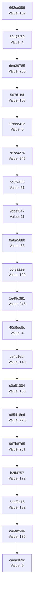

# Hash Chain Visualization

```mermaid
graph TD
    C0["caea369c<br/>Value: 9"]
    C1["c46ae506<br/>Value: 136"]
    C1 --> C0
    C2["5daf2d16<br/>Value: 182"]
    C2 --> C1
    C3["b2ff4757<br/>Value: 172"]
    C3 --> C2
    C4["967b87d5<br/>Value: 231"]
    C4 --> C3
    C5["a85418ed<br/>Value: 226"]
    C5 --> C4
    C6["c0e81004<br/>Value: 136"]
    C6 --> C5
    C7["ce4c1ebf<br/>Value: 140"]
    C7 --> C6
    C8["40d9ee5c<br/>Value: 4"]
    C8 --> C7
    C9["1e49c381<br/>Value: 246"]
    C9 --> C8
    C10["00f3aa99<br/>Value: 129"]
    C10 --> C9
    C11["0a6a5680<br/>Value: 63"]
    C11 --> C10
    C12["9dcef047<br/>Value: 11"]
    C12 --> C11
    C13["bc8f7465<br/>Value: 51"]
    C13 --> C12
    C14["787c4276<br/>Value: 245"]
    C14 --> C13
    C15["178ee412<br/>Value: 0"]
    C15 --> C14
    C16["567d1f9f<br/>Value: 108"]
    C16 --> C15
    C17["dea39785<br/>Value: 235"]
    C17 --> C16
    C18["80e76f59<br/>Value: 4"]
    C18 --> C17
    C19["662ce086<br/>Value: 182"]
    C19 --> C18
```