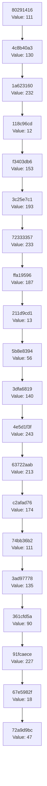

# Hash Chain Visualization

```mermaid
graph TD
    C0["72a9d9bc<br/>Value: 47"]
    C1["67e5982f<br/>Value: 18"]
    C1 --> C0
    C2["91fcaece<br/>Value: 227"]
    C2 --> C1
    C3["361cfd5a<br/>Value: 90"]
    C3 --> C2
    C4["3ad97778<br/>Value: 135"]
    C4 --> C3
    C5["74bb36b2<br/>Value: 111"]
    C5 --> C4
    C6["c2afad76<br/>Value: 174"]
    C6 --> C5
    C7["63722aab<br/>Value: 213"]
    C7 --> C6
    C8["4e5d1f3f<br/>Value: 243"]
    C8 --> C7
    C9["3dfa6819<br/>Value: 140"]
    C9 --> C8
    C10["5b8e8394<br/>Value: 56"]
    C10 --> C9
    C11["211d9cd1<br/>Value: 13"]
    C11 --> C10
    C12["ffa19596<br/>Value: 187"]
    C12 --> C11
    C13["72333357<br/>Value: 233"]
    C13 --> C12
    C14["3c25e7c1<br/>Value: 193"]
    C14 --> C13
    C15["f3403db6<br/>Value: 153"]
    C15 --> C14
    C16["118c96cd<br/>Value: 12"]
    C16 --> C15
    C17["1a623160<br/>Value: 232"]
    C17 --> C16
    C18["4c8b40a3<br/>Value: 130"]
    C18 --> C17
    C19["80291416<br/>Value: 111"]
    C19 --> C18
```