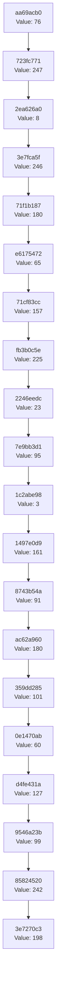

# Hash Chain Visualization

```mermaid
graph TD
    C0["3e7270c3<br/>Value: 198"]
    C1["85824520<br/>Value: 242"]
    C1 --> C0
    C2["9546a23b<br/>Value: 99"]
    C2 --> C1
    C3["d4fe431a<br/>Value: 127"]
    C3 --> C2
    C4["0e1470ab<br/>Value: 60"]
    C4 --> C3
    C5["359dd285<br/>Value: 101"]
    C5 --> C4
    C6["ac62a960<br/>Value: 180"]
    C6 --> C5
    C7["8743b54a<br/>Value: 91"]
    C7 --> C6
    C8["1497e0d9<br/>Value: 161"]
    C8 --> C7
    C9["1c2abe98<br/>Value: 3"]
    C9 --> C8
    C10["7e9bb3d1<br/>Value: 95"]
    C10 --> C9
    C11["2246eedc<br/>Value: 23"]
    C11 --> C10
    C12["fb3b0c5e<br/>Value: 225"]
    C12 --> C11
    C13["71cf83cc<br/>Value: 157"]
    C13 --> C12
    C14["e6175472<br/>Value: 65"]
    C14 --> C13
    C15["71f1b187<br/>Value: 180"]
    C15 --> C14
    C16["3e7fca5f<br/>Value: 246"]
    C16 --> C15
    C17["2ea626a0<br/>Value: 8"]
    C17 --> C16
    C18["723fc771<br/>Value: 247"]
    C18 --> C17
    C19["aa69acb0<br/>Value: 76"]
    C19 --> C18
```