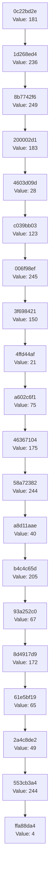

# Hash Chain Visualization

```mermaid
graph TD
    C0["ffa88da4<br/>Value: 4"]
    C1["553cb3a4<br/>Value: 244"]
    C1 --> C0
    C2["2a4c8de2<br/>Value: 49"]
    C2 --> C1
    C3["61e5bf19<br/>Value: 65"]
    C3 --> C2
    C4["8d4917d9<br/>Value: 172"]
    C4 --> C3
    C5["93a252c0<br/>Value: 67"]
    C5 --> C4
    C6["b4c4c65d<br/>Value: 205"]
    C6 --> C5
    C7["a8d11aae<br/>Value: 40"]
    C7 --> C6
    C8["58a72382<br/>Value: 244"]
    C8 --> C7
    C9["46367104<br/>Value: 175"]
    C9 --> C8
    C10["a602c6f1<br/>Value: 75"]
    C10 --> C9
    C11["4ffd44af<br/>Value: 21"]
    C11 --> C10
    C12["3f698421<br/>Value: 150"]
    C12 --> C11
    C13["006f98ef<br/>Value: 245"]
    C13 --> C12
    C14["c039bb03<br/>Value: 123"]
    C14 --> C13
    C15["4603d09d<br/>Value: 28"]
    C15 --> C14
    C16["200002d1<br/>Value: 183"]
    C16 --> C15
    C17["8b7742f6<br/>Value: 249"]
    C17 --> C16
    C18["1d268ed4<br/>Value: 236"]
    C18 --> C17
    C19["0c22bd2e<br/>Value: 181"]
    C19 --> C18
```