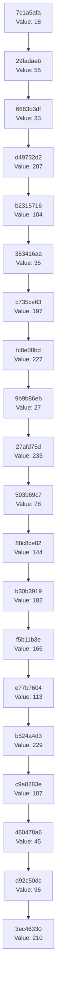

# Hash Chain Visualization

```mermaid
graph TD
    C0["3ec46330<br/>Value: 210"]
    C1["d92c50dc<br/>Value: 96"]
    C1 --> C0
    C2["460478a6<br/>Value: 45"]
    C2 --> C1
    C3["c9a8283e<br/>Value: 107"]
    C3 --> C2
    C4["b524a4d3<br/>Value: 229"]
    C4 --> C3
    C5["e77b7604<br/>Value: 113"]
    C5 --> C4
    C6["f5b11b3e<br/>Value: 166"]
    C6 --> C5
    C7["b30b3919<br/>Value: 182"]
    C7 --> C6
    C8["88c8ce82<br/>Value: 144"]
    C8 --> C7
    C9["593b69c7<br/>Value: 78"]
    C9 --> C8
    C10["27afd75d<br/>Value: 233"]
    C10 --> C9
    C11["9b9b86eb<br/>Value: 27"]
    C11 --> C10
    C12["fc8e08bd<br/>Value: 227"]
    C12 --> C11
    C13["c735ce63<br/>Value: 197"]
    C13 --> C12
    C14["353416aa<br/>Value: 35"]
    C14 --> C13
    C15["b2315716<br/>Value: 104"]
    C15 --> C14
    C16["d49732d2<br/>Value: 207"]
    C16 --> C15
    C17["6663b3df<br/>Value: 33"]
    C17 --> C16
    C18["29fadaeb<br/>Value: 55"]
    C18 --> C17
    C19["7c1a5afa<br/>Value: 18"]
    C19 --> C18
```