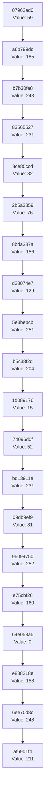

# Hash Chain Visualization

```mermaid
graph TD
    C0["af69d1f4<br/>Value: 211"]
    C1["6ee70d8c<br/>Value: 248"]
    C1 --> C0
    C2["e888218e<br/>Value: 158"]
    C2 --> C1
    C3["64e058a5<br/>Value: 0"]
    C3 --> C2
    C4["e75cbf26<br/>Value: 160"]
    C4 --> C3
    C5["9509475d<br/>Value: 252"]
    C5 --> C4
    C6["09db9ef9<br/>Value: 81"]
    C6 --> C5
    C7["bd13911e<br/>Value: 231"]
    C7 --> C6
    C8["74096d0f<br/>Value: 52"]
    C8 --> C7
    C9["1d089176<br/>Value: 15"]
    C9 --> C8
    C10["b5c38f2d<br/>Value: 204"]
    C10 --> C9
    C11["5e3bebcb<br/>Value: 251"]
    C11 --> C10
    C12["d28074e7<br/>Value: 129"]
    C12 --> C11
    C13["8bda337a<br/>Value: 156"]
    C13 --> C12
    C14["2b5a3859<br/>Value: 76"]
    C14 --> C13
    C15["8ce85ccd<br/>Value: 82"]
    C15 --> C14
    C16["83565527<br/>Value: 231"]
    C16 --> C15
    C17["b7b30fe8<br/>Value: 243"]
    C17 --> C16
    C18["a6b799dc<br/>Value: 185"]
    C18 --> C17
    C19["07962ad0<br/>Value: 59"]
    C19 --> C18
```