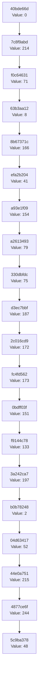

# Hash Chain Visualization

```mermaid
graph TD
    C0["5c9ba378<br/>Value: 48"]
    C1["4877ce6f<br/>Value: 244"]
    C1 --> C0
    C2["44e0a751<br/>Value: 215"]
    C2 --> C1
    C3["04d63417<br/>Value: 52"]
    C3 --> C2
    C4["b0b78248<br/>Value: 2"]
    C4 --> C3
    C5["3a242ca7<br/>Value: 197"]
    C5 --> C4
    C6["f9144c78<br/>Value: 133"]
    C6 --> C5
    C7["0bdff03f<br/>Value: 151"]
    C7 --> C6
    C8["fc4fd562<br/>Value: 173"]
    C8 --> C7
    C9["2c016cd9<br/>Value: 172"]
    C9 --> C8
    C10["d3ec7bbf<br/>Value: 187"]
    C10 --> C9
    C11["330dbfdc<br/>Value: 75"]
    C11 --> C10
    C12["a2613493<br/>Value: 79"]
    C12 --> C11
    C13["a93e1f09<br/>Value: 154"]
    C13 --> C12
    C14["efa2b204<br/>Value: 41"]
    C14 --> C13
    C15["8b67371c<br/>Value: 166"]
    C15 --> C14
    C16["63b3aa12<br/>Value: 8"]
    C16 --> C15
    C17["f0c64631<br/>Value: 71"]
    C17 --> C16
    C18["7c8f9abd<br/>Value: 214"]
    C18 --> C17
    C19["40bde66d<br/>Value: 0"]
    C19 --> C18
```