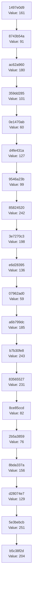

# Hash Chain Visualization

```mermaid
graph TD
    C0["b5c38f2d<br/>Value: 204"]
    C1["5e3bebcb<br/>Value: 251"]
    C1 --> C0
    C2["d28074e7<br/>Value: 129"]
    C2 --> C1
    C3["8bda337a<br/>Value: 156"]
    C3 --> C2
    C4["2b5a3859<br/>Value: 76"]
    C4 --> C3
    C5["8ce85ccd<br/>Value: 82"]
    C5 --> C4
    C6["83565527<br/>Value: 231"]
    C6 --> C5
    C7["b7b30fe8<br/>Value: 243"]
    C7 --> C6
    C8["a6b799dc<br/>Value: 185"]
    C8 --> C7
    C9["07962ad0<br/>Value: 59"]
    C9 --> C8
    C10["e6d28395<br/>Value: 136"]
    C10 --> C9
    C11["3e7270c3<br/>Value: 198"]
    C11 --> C10
    C12["85824520<br/>Value: 242"]
    C12 --> C11
    C13["9546a23b<br/>Value: 99"]
    C13 --> C12
    C14["d4fe431a<br/>Value: 127"]
    C14 --> C13
    C15["0e1470ab<br/>Value: 60"]
    C15 --> C14
    C16["359dd285<br/>Value: 101"]
    C16 --> C15
    C17["ac62a960<br/>Value: 180"]
    C17 --> C16
    C18["8743b54a<br/>Value: 91"]
    C18 --> C17
    C19["1497e0d9<br/>Value: 161"]
    C19 --> C18
```