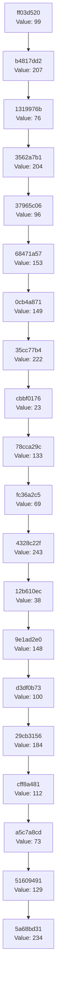

# Hash Chain Visualization

```mermaid
graph TD
    C0["5a68bd31<br/>Value: 234"]
    C1["51609491<br/>Value: 129"]
    C1 --> C0
    C2["a5c7a8cd<br/>Value: 73"]
    C2 --> C1
    C3["cff8a481<br/>Value: 112"]
    C3 --> C2
    C4["29cb3156<br/>Value: 184"]
    C4 --> C3
    C5["d3df0b73<br/>Value: 100"]
    C5 --> C4
    C6["9e1ad2e0<br/>Value: 148"]
    C6 --> C5
    C7["12b610ec<br/>Value: 38"]
    C7 --> C6
    C8["4328c22f<br/>Value: 243"]
    C8 --> C7
    C9["fc36a2c5<br/>Value: 69"]
    C9 --> C8
    C10["78cca29c<br/>Value: 133"]
    C10 --> C9
    C11["cbbf0176<br/>Value: 23"]
    C11 --> C10
    C12["35cc77b4<br/>Value: 222"]
    C12 --> C11
    C13["0cb4a871<br/>Value: 149"]
    C13 --> C12
    C14["68471a57<br/>Value: 153"]
    C14 --> C13
    C15["37965c06<br/>Value: 96"]
    C15 --> C14
    C16["3562a7b1<br/>Value: 204"]
    C16 --> C15
    C17["1319976b<br/>Value: 76"]
    C17 --> C16
    C18["b4817dd2<br/>Value: 207"]
    C18 --> C17
    C19["ff03d520<br/>Value: 99"]
    C19 --> C18
```