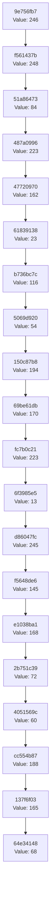

# Hash Chain Visualization

```mermaid
graph TD
    C0["64e34148<br/>Value: 68"]
    C1["137f6f03<br/>Value: 165"]
    C1 --> C0
    C2["cc554b87<br/>Value: 188"]
    C2 --> C1
    C3["4051569c<br/>Value: 60"]
    C3 --> C2
    C4["2b751c39<br/>Value: 72"]
    C4 --> C3
    C5["e1038ba1<br/>Value: 168"]
    C5 --> C4
    C6["f5648de6<br/>Value: 145"]
    C6 --> C5
    C7["d86047fc<br/>Value: 245"]
    C7 --> C6
    C8["6f3985e5<br/>Value: 13"]
    C8 --> C7
    C9["fc7b0c21<br/>Value: 223"]
    C9 --> C8
    C10["69be61db<br/>Value: 170"]
    C10 --> C9
    C11["150c87b8<br/>Value: 194"]
    C11 --> C10
    C12["5069d920<br/>Value: 54"]
    C12 --> C11
    C13["b736bc7c<br/>Value: 116"]
    C13 --> C12
    C14["61839138<br/>Value: 23"]
    C14 --> C13
    C15["47720970<br/>Value: 162"]
    C15 --> C14
    C16["487a0996<br/>Value: 223"]
    C16 --> C15
    C17["51a86473<br/>Value: 84"]
    C17 --> C16
    C18["f561437b<br/>Value: 248"]
    C18 --> C17
    C19["9e756fb7<br/>Value: 246"]
    C19 --> C18
```