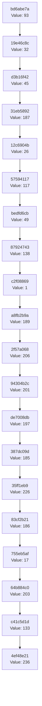

# Hash Chain Visualization

```mermaid
graph TD
    C0["4ef48e21<br/>Value: 236"]
    C1["c41c5d1d<br/>Value: 133"]
    C1 --> C0
    C2["64b884c0<br/>Value: 203"]
    C2 --> C1
    C3["755eb5af<br/>Value: 17"]
    C3 --> C2
    C4["83cf2b21<br/>Value: 186"]
    C4 --> C3
    C5["35ff1eb9<br/>Value: 226"]
    C5 --> C4
    C6["387dc09d<br/>Value: 185"]
    C6 --> C5
    C7["de7008db<br/>Value: 197"]
    C7 --> C6
    C8["94304b2c<br/>Value: 201"]
    C8 --> C7
    C9["2f57a068<br/>Value: 206"]
    C9 --> C8
    C10["a8fb2b9a<br/>Value: 189"]
    C10 --> C9
    C11["c2f08869<br/>Value: 1"]
    C11 --> C10
    C12["87924743<br/>Value: 138"]
    C12 --> C11
    C13["bedfd6cb<br/>Value: 49"]
    C13 --> C12
    C14["57594117<br/>Value: 117"]
    C14 --> C13
    C15["12c6904b<br/>Value: 26"]
    C15 --> C14
    C16["31eb5892<br/>Value: 187"]
    C16 --> C15
    C17["d3b16f42<br/>Value: 45"]
    C17 --> C16
    C18["19e46c8c<br/>Value: 32"]
    C18 --> C17
    C19["bd6abe7a<br/>Value: 93"]
    C19 --> C18
```