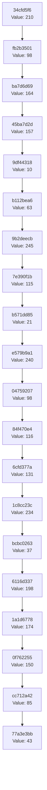

# Hash Chain Visualization

```mermaid
graph TD
    C0["77a3e3bb<br/>Value: 43"]
    C1["cc712a42<br/>Value: 85"]
    C1 --> C0
    C2["0f762255<br/>Value: 150"]
    C2 --> C1
    C3["1a1d6778<br/>Value: 174"]
    C3 --> C2
    C4["6116d337<br/>Value: 198"]
    C4 --> C3
    C5["bcbc0263<br/>Value: 37"]
    C5 --> C4
    C6["1c8cc23c<br/>Value: 234"]
    C6 --> C5
    C7["6cfd377a<br/>Value: 131"]
    C7 --> C6
    C8["84f470e4<br/>Value: 116"]
    C8 --> C7
    C9["04759207<br/>Value: 98"]
    C9 --> C8
    C10["e579b9a1<br/>Value: 240"]
    C10 --> C9
    C11["b571dd85<br/>Value: 21"]
    C11 --> C10
    C12["7e390f1b<br/>Value: 115"]
    C12 --> C11
    C13["9b2deecb<br/>Value: 245"]
    C13 --> C12
    C14["b112bea6<br/>Value: 63"]
    C14 --> C13
    C15["9df44318<br/>Value: 10"]
    C15 --> C14
    C16["45ba7d2d<br/>Value: 157"]
    C16 --> C15
    C17["ba7d6d69<br/>Value: 164"]
    C17 --> C16
    C18["fb2b3501<br/>Value: 98"]
    C18 --> C17
    C19["34cfd5f6<br/>Value: 210"]
    C19 --> C18
```