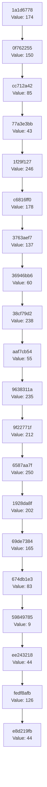

# Hash Chain Visualization

```mermaid
graph TD
    C0["e8d219fb<br/>Value: 44"]
    C1["fedf8afb<br/>Value: 126"]
    C1 --> C0
    C2["ee243218<br/>Value: 44"]
    C2 --> C1
    C3["59849785<br/>Value: 9"]
    C3 --> C2
    C4["674db1e3<br/>Value: 83"]
    C4 --> C3
    C5["69de7384<br/>Value: 165"]
    C5 --> C4
    C6["1928da8f<br/>Value: 202"]
    C6 --> C5
    C7["6587aa7f<br/>Value: 250"]
    C7 --> C6
    C8["9f22771f<br/>Value: 212"]
    C8 --> C7
    C9["9638311a<br/>Value: 235"]
    C9 --> C8
    C10["aaf7cb54<br/>Value: 55"]
    C10 --> C9
    C11["38cf79d2<br/>Value: 238"]
    C11 --> C10
    C12["36946bb6<br/>Value: 60"]
    C12 --> C11
    C13["3763aef7<br/>Value: 137"]
    C13 --> C12
    C14["c6816ff0<br/>Value: 178"]
    C14 --> C13
    C15["1f29f127<br/>Value: 246"]
    C15 --> C14
    C16["77a3e3bb<br/>Value: 43"]
    C16 --> C15
    C17["cc712a42<br/>Value: 85"]
    C17 --> C16
    C18["0f762255<br/>Value: 150"]
    C18 --> C17
    C19["1a1d6778<br/>Value: 174"]
    C19 --> C18
```