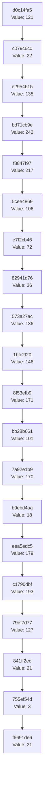

# Hash Chain Visualization

```mermaid
graph TD
    C0["f6691de6<br/>Value: 21"]
    C1["755ef54d<br/>Value: 3"]
    C1 --> C0
    C2["841ff2ec<br/>Value: 21"]
    C2 --> C1
    C3["79ef7d77<br/>Value: 127"]
    C3 --> C2
    C4["c1790dbf<br/>Value: 193"]
    C4 --> C3
    C5["eea5edc5<br/>Value: 179"]
    C5 --> C4
    C6["b9ebd4aa<br/>Value: 18"]
    C6 --> C5
    C7["7a92e1b9<br/>Value: 170"]
    C7 --> C6
    C8["bb28b661<br/>Value: 101"]
    C8 --> C7
    C9["8f53efb9<br/>Value: 171"]
    C9 --> C8
    C10["1bfc2f20<br/>Value: 146"]
    C10 --> C9
    C11["573a27ac<br/>Value: 136"]
    C11 --> C10
    C12["82941d76<br/>Value: 36"]
    C12 --> C11
    C13["e7f2cb46<br/>Value: 72"]
    C13 --> C12
    C14["5cee4869<br/>Value: 106"]
    C14 --> C13
    C15["f8847f97<br/>Value: 217"]
    C15 --> C14
    C16["bd71cb9e<br/>Value: 242"]
    C16 --> C15
    C17["e2954615<br/>Value: 138"]
    C17 --> C16
    C18["c079c6c0<br/>Value: 22"]
    C18 --> C17
    C19["d0c14fa5<br/>Value: 121"]
    C19 --> C18
```