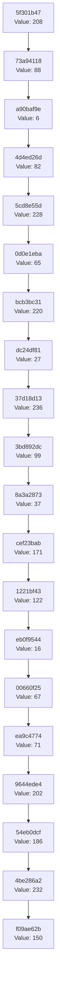

# Hash Chain Visualization

```mermaid
graph TD
    C0["f09ae62b<br/>Value: 150"]
    C1["4be286a2<br/>Value: 232"]
    C1 --> C0
    C2["54eb0dcf<br/>Value: 186"]
    C2 --> C1
    C3["9644ede4<br/>Value: 202"]
    C3 --> C2
    C4["ea9c4774<br/>Value: 71"]
    C4 --> C3
    C5["00660f25<br/>Value: 67"]
    C5 --> C4
    C6["eb0f9544<br/>Value: 16"]
    C6 --> C5
    C7["1221bf43<br/>Value: 122"]
    C7 --> C6
    C8["cef23bab<br/>Value: 171"]
    C8 --> C7
    C9["8a3a2873<br/>Value: 37"]
    C9 --> C8
    C10["3bd892dc<br/>Value: 99"]
    C10 --> C9
    C11["37d18d13<br/>Value: 236"]
    C11 --> C10
    C12["dc24df81<br/>Value: 27"]
    C12 --> C11
    C13["bcb3bc31<br/>Value: 220"]
    C13 --> C12
    C14["0d0e1eba<br/>Value: 65"]
    C14 --> C13
    C15["5cd8e55d<br/>Value: 228"]
    C15 --> C14
    C16["4d4ed26d<br/>Value: 82"]
    C16 --> C15
    C17["a90baf9e<br/>Value: 6"]
    C17 --> C16
    C18["73a94118<br/>Value: 88"]
    C18 --> C17
    C19["5f301b47<br/>Value: 208"]
    C19 --> C18
```