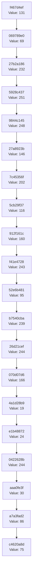

# Hash Chain Visualization

```mermaid
graph TD
    C0["c4620a8d<br/>Value: 75"]
    C1["a7a3fad2<br/>Value: 86"]
    C1 --> C0
    C2["aaa0fe3f<br/>Value: 30"]
    C2 --> C1
    C3["0422628b<br/>Value: 244"]
    C3 --> C2
    C4["e1b48872<br/>Value: 24"]
    C4 --> C3
    C5["4a1d28b9<br/>Value: 19"]
    C5 --> C4
    C6["070d07d6<br/>Value: 166"]
    C6 --> C5
    C7["26d21cef<br/>Value: 244"]
    C7 --> C6
    C8["b7540cba<br/>Value: 239"]
    C8 --> C7
    C9["52e6b481<br/>Value: 95"]
    C9 --> C8
    C10["f41e4728<br/>Value: 243"]
    C10 --> C9
    C11["912f161c<br/>Value: 160"]
    C11 --> C10
    C12["5cb29f37<br/>Value: 116"]
    C12 --> C11
    C13["7c45356f<br/>Value: 202"]
    C13 --> C12
    C14["27a8923b<br/>Value: 146"]
    C14 --> C13
    C15["9844c145<br/>Value: 248"]
    C15 --> C14
    C16["5928c437<br/>Value: 251"]
    C16 --> C15
    C17["27b2a186<br/>Value: 232"]
    C17 --> C16
    C18["069789e0<br/>Value: 69"]
    C18 --> C17
    C19["f467d4ef<br/>Value: 131"]
    C19 --> C18
```