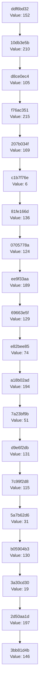

# Hash Chain Visualization

```mermaid
graph TD
    C0["3bb81d4b<br/>Value: 146"]
    C1["2d50aa1d<br/>Value: 197"]
    C1 --> C0
    C2["3a30cd30<br/>Value: 19"]
    C2 --> C1
    C3["b05904b3<br/>Value: 130"]
    C3 --> C2
    C4["5a7b62d6<br/>Value: 31"]
    C4 --> C3
    C5["7c99f2d8<br/>Value: 115"]
    C5 --> C4
    C6["d9e6f2db<br/>Value: 131"]
    C6 --> C5
    C7["7a23bf9b<br/>Value: 51"]
    C7 --> C6
    C8["a18b02ad<br/>Value: 194"]
    C8 --> C7
    C9["e82bee85<br/>Value: 74"]
    C9 --> C8
    C10["69663e5f<br/>Value: 129"]
    C10 --> C9
    C11["ee9f33aa<br/>Value: 189"]
    C11 --> C10
    C12["0705778a<br/>Value: 124"]
    C12 --> C11
    C13["81fe166d<br/>Value: 136"]
    C13 --> C12
    C14["c1b7f76e<br/>Value: 6"]
    C14 --> C13
    C15["207b034f<br/>Value: 169"]
    C15 --> C14
    C16["f76ac351<br/>Value: 215"]
    C16 --> C15
    C17["d8ce0ec4<br/>Value: 105"]
    C17 --> C16
    C18["10db3e5b<br/>Value: 210"]
    C18 --> C17
    C19["ddf6bd32<br/>Value: 152"]
    C19 --> C18
```