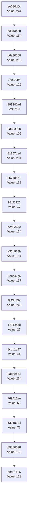

# Hash Chain Visualization

```mermaid
graph TD
    C0["edd01126<br/>Value: 138"]
    C1["89800098<br/>Value: 163"]
    C1 --> C0
    C2["1391a204<br/>Value: 71"]
    C2 --> C1
    C3["769416ae<br/>Value: 68"]
    C3 --> C2
    C4["9abeec34<br/>Value: 234"]
    C4 --> C3
    C5["8cbd1d47<br/>Value: 44"]
    C5 --> C4
    C6["1271cbac<br/>Value: 26"]
    C6 --> C5
    C7["f943b83a<br/>Value: 248"]
    C7 --> C6
    C8["3ebc42c6<br/>Value: 137"]
    C8 --> C7
    C9["a36d923b<br/>Value: 114"]
    C9 --> C8
    C10["eed2366c<br/>Value: 134"]
    C10 --> C9
    C11["991f6220<br/>Value: 47"]
    C11 --> C10
    C12["857a8861<br/>Value: 168"]
    C12 --> C11
    C13["81857de4<br/>Value: 204"]
    C13 --> C12
    C14["3a88c33a<br/>Value: 105"]
    C14 --> C13
    C15["399140ad<br/>Value: 0"]
    C15 --> C14
    C16["7db594fd<br/>Value: 120"]
    C16 --> C15
    C17["d6a30158<br/>Value: 215"]
    C17 --> C16
    C18["dd84ac50<br/>Value: 164"]
    C18 --> C17
    C19["ee39dd6c<br/>Value: 244"]
    C19 --> C18
```